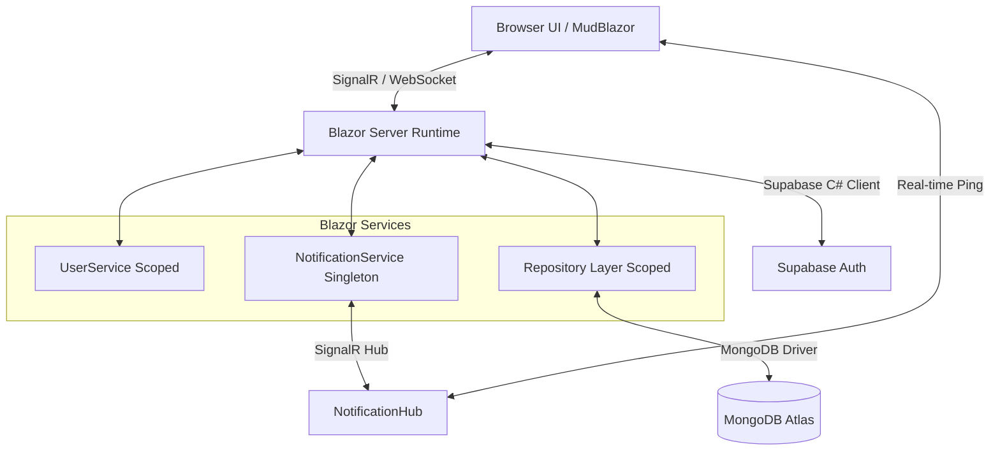
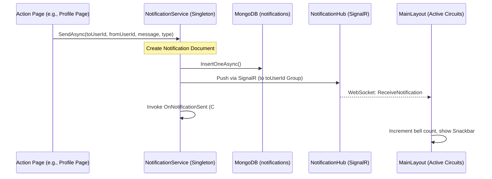

# BlogApp — Project Knowledge Transfer

This document provides a comprehensive guide to the architecture, tech stack, data models, workflows, and configuration of the BlogApp project. It is designed to facilitate onboarding and handovers for developers working on this codebase.

---

## 1. Project Overview & Architecture

BlogApp is a full-stack blogging platform that combines real-time social networking features (following, friending, live notifications) with structured blogging. It is built as a **Blazor Server** application, leveraging C# and SignalR for dynamic server-side rendering, paired with **MongoDB Atlas** for document storage and **Supabase** for user authentication.

### High-Level System Architecture



### Key Architectural Decisions
- **Blazor Server**: Chosen over Blazor WASM to simplify database connectivity (no public API layer required for database access) and to leverage native, low-latency SignalR circuits for real-time notifications.
- **Supabase for Authentication**: Used strictly as an identity provider, managing registration, login, JWT token generation, and secure password hashing.
- **MongoDB for Application Data**: A document database suits blogging structures (variable tags, flexible post layouts) and simplifies schema evolution.
- **Scoped vs. Singleton Services**:
  - `UserService`: Scoped. Stores session-specific data (UserId, Email, tokens) per user connection circuit.
  - `DatabaseService`: Singleton. Maintains a single, shared connection pool to MongoDB across the entire application.
  - `NotificationService`: Singleton. Manages persistent notification writes and coordinates real-time SignalR broadcasts and in-memory C# events across user sessions.

---

## 2. Tech Stack & Dependencies

| Technology | Purpose | Implementation Details |
| :--- | :--- | :--- |
| **C# / .NET 9** | Core platform | Backend runtime and language |
| **Blazor Server** | Application framework | Handles routing, page rendering, and state via SignalR |
| **MudBlazor** | UI Component Library | Material Design components (AppBar, Drawer, Grid, Cards, Buttons) |
| **MongoDB.Driver** | Database client | Official MongoDB driver for C# |
| **Supabase-csharp** | Authentication client | Integrates Supabase GoTrue Auth API with Blazor |
| **Markdig** | Markdown engine | Converts raw Markdown text into safe, renderable HTML |
| **Microsoft.AspNetCore.SignalR** | Real-time messaging | Drives instant notification delivery |

---

## 3. Project Structure

The codebase is structured into logical layers following ASP.NET Core conventions:

```
BlogApp/
├── Components/               # UI Layouts and shared Razor components
│   └── Layout/
│       └── MainLayout.razor  # App shell, routing protection, session restoration, and notification listener
├── Data/                     # Data Access Object (DAO) / Repository Layer
│   ├── BlogRepository.cs     # Manages CRUD and visibility filtering for posts
│   ├── ConnectionRepository.cs # Manages follow/unfollow, friend requests, and social queries
│   └── UserProfileRepository.cs # Manages custom user handles, bios, and displays
├── Helpers/                  # Utility classes (e.g., Slug generation, Text helpers)
├── Hubs/                     # SignalR Hubs
│   └── NotificationHub.cs    # Real-time WebSocket connection router for notifications
├── Models/                   # Data transfer objects and schema definitions
│   ├── BlogPost.cs           # Post structure and metadata
│   ├── Notification.cs       # Alerts for follows, friend requests, etc.
│   ├── UserConnection.cs     # Tracks social links (follow vs. friend)
│   └── UserProfile.cs        # User handles and biographies
├── Pages/                    # Routable page components
│   ├── BlogEditor.razor      # Post creation and editing with real-time Markdown preview
│   ├── Home.razor            # Main dashboard and filtered post feed
│   ├── Login.razor           # User login page
│   ├── Signup.razor          # User registration and initial username selection
│   ├── UserProfile.razor     # Public/private profiles displaying stats and user posts
│   ├── ProfileSettings.razor # User settings to update handles and biographies
│   ├── PostView.razor        # Renders full blog post, actions, and comments
│   ├── Notifications.razor   # Complete notification list with read/unread tracking
│   └── NotFound.razor        # Custom 404 page
├── Services/                 # Shared logic and services
│   ├── DatabaseService.cs    # Establishes and exposes the MongoDB connection
│   ├── NotificationService.cs # Saves notifications and pushes them via SignalR/Events
│   └── UserService.cs        # Scoped container for the currently logged-in user's data
├── wwwroot/                  # Static web assets (CSS, JS, images)
├── appsettings.json          # Global configuration
├── appsettings.Development.json # Development configuration (databases & auth keys)
└── Program.cs                # Application entry point, service registrations, and middleware
```

---

## 4. Data Models & Schemas

All application data (excluding auth accounts managed by Supabase) resides in MongoDB. The collections are defined below.

### 4.1. BlogPost (`posts` collection)
Stores all blog posts written by users. Includes support for tags, slugs, and access visibility.

```csharp
public class BlogPost
{
    [BsonId]
    [BsonRepresentation(BsonType.ObjectId)]
    public string? Id { get; set; }

    public string Title { get; set; } = "";
    public string Content { get; set; } = "";
    public string AuthorId { get; set; } = ""; // Maps to Supabase User ID
    public string Slug { get; set; } = "";
    public string Summary { get; set; } = "";
    public string Visibility { get; set; } = "Public"; // "Public", "Followers", "Private"
    public List<string> Tags { get; set; } = new();
    public DateTime CreatedAt { get; set; } = DateTime.UtcNow;
    public DateTime UpdatedAt { get; set; } = DateTime.UtcNow;
}
```

### 4.2. UserConnection (`connections` collection)
Represents social relationships. Covers both asymmetric "follows" and symmetric "friendships".

```csharp
public class UserConnection
{
    [BsonId]
    [BsonRepresentation(BsonType.ObjectId)]
    public string? Id { get; set; }

    public string FollowerUserId { get; set; } = "";  // Initiator of the connection
    public string FollowingUserId { get; set; } = ""; // Target of the connection
    public string Type { get; set; } = "follow";       // "follow" or "friend"
    public string Status { get; set; } = "accepted";   // "accepted" (follows are instant) or "pending" (friend requests)
    public DateTime CreatedAt { get; set; } = DateTime.UtcNow;
}
```

### 4.3. UserProfile (`userprofiles` collection)
Maps Supabase accounts to custom application identities such as unique handles and biographies.

```csharp
public class UserProfile
{
    [BsonId]
    [BsonRepresentation(BsonType.ObjectId)]
    public string? Id { get; set; }

    public string UserId { get; set; } = "";     // Maps to Supabase User ID
    public string Username { get; set; } = "";   // Unique handle (e.g. "johndoe")
    public string Bio { get; set; } = "";        // Description of the user
    public DateTime CreatedAt { get; set; } = DateTime.UtcNow;
}
```

### 4.4. Notification (`notifications` collection)
Stores persistent notifications that are displayed on the user's notification page.

```csharp
public class Notification
{
    [BsonId]
    [BsonRepresentation(BsonType.ObjectId)]
    public string? Id { get; set; }

    public string ToUserId { get; set; } = "";     // Recipient of the notification
    public string FromUserId { get; set; } = "";   // Generator of the action
    public string Message { get; set; } = "";      // Descriptive notification text
    public string Type { get; set; } = "";         // "follow", "friend_request", or "new_post"
    public bool IsRead { get; set; } = false;
    public DateTime CreatedAt { get; set; } = DateTime.UtcNow;
}
```

---

## 5. Key Workflows & Implementation Details

### 5.1. Authentication & Session Persistence
The authentication system is a hybrid model. Supabase verifies credentials, while Blazor manages state.

1. **Sign In / Sign Up**: Users submit credentials on `/login` or `/signup`. Supabase validates the input and returns an access token and a refresh token.
2. **Session Storage**: To prevent session loss when a user refreshes the page (which destroys the Blazor SignalR circuit and resets memory services), the tokens are stored in the browser's local storage using `ProtectedLocalStorage` during the `OnAfterRenderAsync(firstRender: true)` lifecycle step in `MainLayout.razor`.
3. **Session Restoration**: On a fresh circuit start, `MainLayout` checks local storage for tokens, passes them to the Supabase client via `SetSession()`, and populates the scoped `UserService`.
4. **Route Protection**: If `UserService.IsLoggedIn` is false and the path is not `/login` or `/signup`, the user is redirected to the login page.

### 5.2. Post Visibility and Feed Filtering
When loading the homepage feed, the system filters posts based on the viewer's social connections to enforce privacy boundaries. This filtering is handled in `BlogRepository.GetFeedAsync` using MongoDB queries:

- **Public**: Any user can view.
- **Followers**: Visible only if the viewer follows the post's author. The repository retrieves the list of user IDs the current user is following and matches:
  `Visibility == "Followers" && AuthorId IN (followingUserIds)`
- **Private**: Visible to the author themselves, or to mutual friends. The repository queries:
  `Visibility == "Private" && (AuthorId == currentUserId || AuthorId IN (friendUserIds))`

### 5.3. Real-Time Notification Pipeline
The real-time notification engine operates across three layers: database storage, SignalR hubs, and local in-memory event handlers.



1. **Hub Routing**: On load, `MainLayout` registers the logged-in user into a SignalR group named after their `UserId`.
2. **Persistence & Dispatch**: When an event occurs (e.g., User A follows User B), `NotificationService.SendAsync()` is invoked:
   - The notification is saved to MongoDB.
   - The SignalR hub pushes the notification to the target user's group.
   - An internal C# event `OnNotificationSent` is triggered.
3. **UI Reception**: If the target user is connected, `MainLayout` receives the SignalR message, increments the badge count, and displays a MudBlazor snackbar notification.

---

## 6. Development Setup & Configuration

### Prerequisites
- **.NET 9 SDK** installed.
- **MongoDB Atlas** database (or a local MongoDB instance).
- **Supabase Project** with email authentication enabled.

### Configuration (`appsettings.Development.json`)
Create a file named `appsettings.Development.json` in the root of the project with the following structure:

```json
{
  "Logging": {
    "LogLevel": {
      "Default": "Information",
      "Microsoft.AspNetCore": "Warning"
    }
  },
  "Supabase": {
    "Url": "https://your-project-id.supabase.co",
    "AnonKey": "your-supabase-anonymous-key"
  },
  "MongoDB": {
    "ConnectionString": "mongodb+srv://<username>:<password>@cluster.mongodb.net/?retryWrites=true&w=majority",
    "DatabaseName": "BlogApp"
  }
}
```

### Build & Run Commands
Run the following commands in the project directory:

```bash
# Restore project dependencies
dotnet restore

# Run the application locally in development mode
dotnet run
```
The application will start, typically exposing `https://localhost:7065` and `http://localhost:5076` (check console logs for exact local ports).

---

## 7. Known Issues, Technical Debt & Mitigation Plans

### 7.1. Friend Request Mismatch / Duplicate Connections
- **Symptom**: In certain edge cases, duplicate connections can be created if users rapidly click the "Add Friend" button, leading to mismatched friend counts.
- **Mitigation**:
  - `ConnectionRepository.SendFriendRequestAsync` already contains a directional check.
  - To prevent concurrent insertion, a unique compound index should be applied to the MongoDB collection:
    ```javascript
    db.connections.createIndex({ followerUserId: 1, followingUserId: 1, type: 1 }, { unique: true })
    ```

### 7.2. Circuit Recovery Handling in Blazor Server
- **Symptom**: If a user loses internet connectivity momentarily, the SignalR circuit breaks. The browser will attempt to reconnect, but if it fails, the circuit state is destroyed.
- **Mitigation**:
  - The current implementation uses `ProtectedLocalStorage` to store tokens, enabling session restoration when the page is reloaded.
  - Make sure that all repository service calls handle transient database disconnection exceptions gracefully using retries or user-facing alerts.

---

## 8. Future Development Roadmap

The following features are planned for future phases of the application:

1. **Follower & Following UI Panels**: Instagram-style dialog overlays displaying detailed lists of followers and followed users, accessible by clicking the counts on profile pages.
2. **Reciprocal Notification Triggers**: Dispatches automated notifications when friend requests are accepted or when individuals follow each other back.
3. **Automated AI Post Summarization**: Integrates the OpenAI API or similar services to generate concise summaries of blog articles automatically during the creation process.
4. **RSS Feed Support**: Generates dynamic XML feeds (both public and authenticated token-based feeds for private/follower posts) for RSS readers.
5. **Deployment**:
   - Containerization using Docker with a multi-stage build file.
   - Deployment on Render or similar cloud platforms, connecting to MongoDB Atlas and Supabase Production instances.
